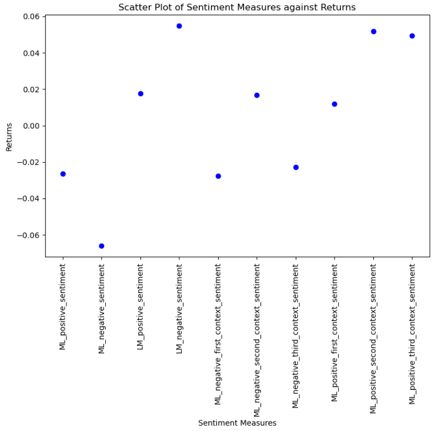
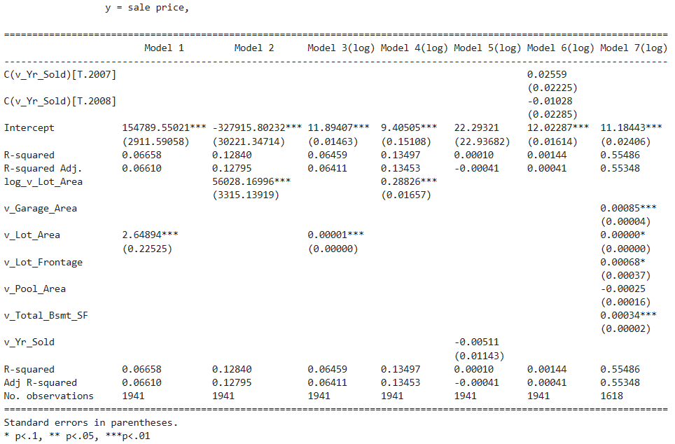

## Yuan Wang

Hi, my name is Yuan Wang. Welcome to my page.

I am an undergraduate student at Lehigh University majoing in finance.

<!-- Upload your own photo and change the path -->

  

---

## Exhibition of my FinTech works

<!-- You can link to other websites, PDFs in this repo, and other pages in this repo -->

_**[Natural language processing 10-Ks to identify risks](report.ipynb)**_

For the midterm project, I gained the basic idea of machine learning. We were asked to download and scraping the informational 10-k report and then came up with a professional report, reflecting the sentiment inside of each 10-k. Here's a glimpse of my work:

---

_**[Regression Practice](Regression_practice)**_

Or: The process that created this page can be used to show off your whole midterm analysis file, as is.

---

_**[Eventual team project](https://donbowen.github.io/teamproject/)**_

---

_**[Some personal project](/pdf/sample_presentation.pdf)**_

---

## Career Objectives

Write what you want. 

Sell yourself!

---

## Hobbies

Maybe include a little about these, especially if they are the kinds of things that work well in interviews.

---

Page template forked from <a href="https://github.com/evanca/quick-portfolio">evanca</a>

<!-- Remove above link if you don't want to attibute -->
